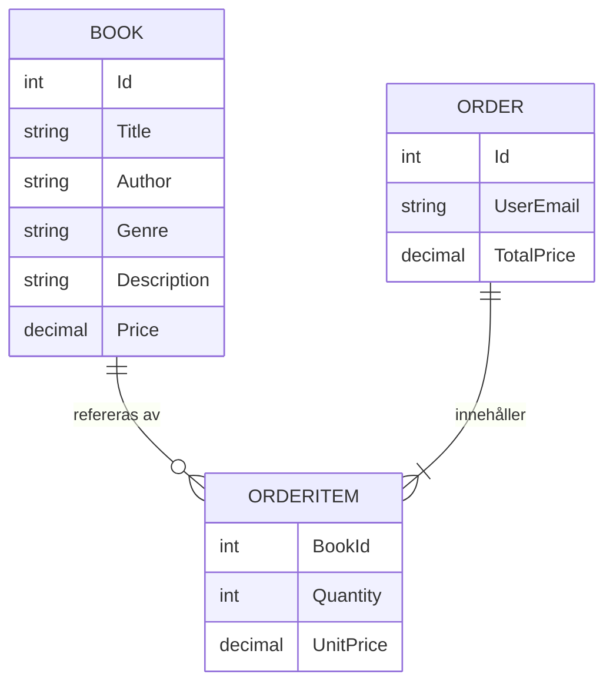
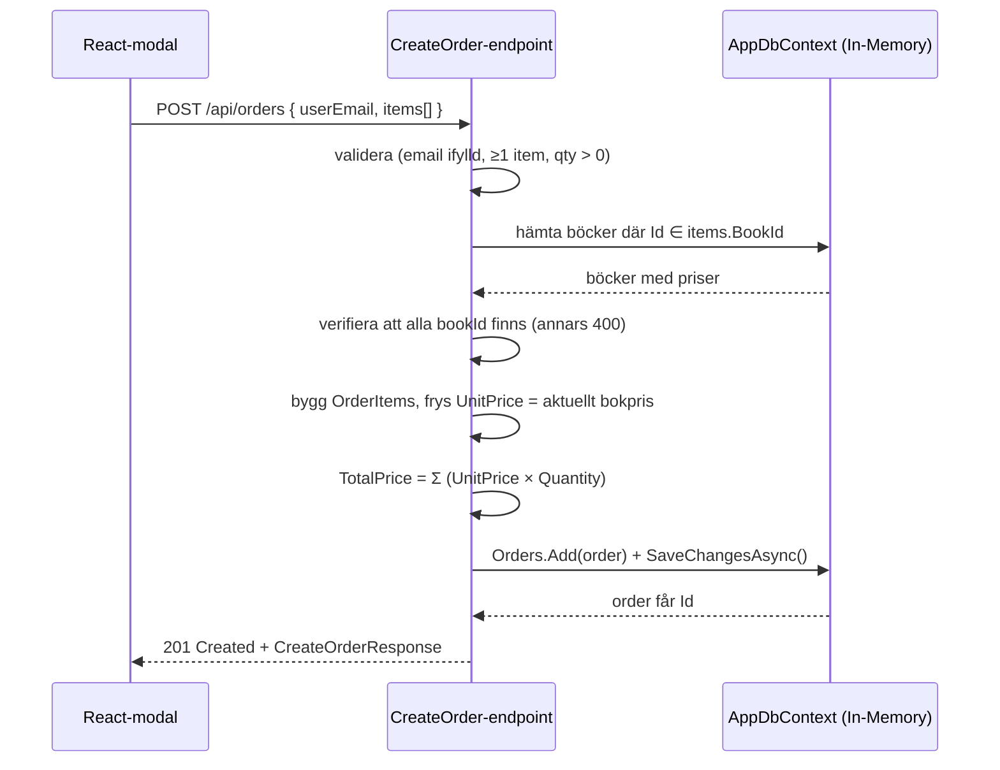

# Master Plan: BookStore Vertical Slice API + React Client

> **Status:** Godkänd – alla beslut låsta. Redo för implementation.
> Demo av vertical architecture / single-file slice-approachen med Ardalis ApiEndpoints.

## 1. Mål

Ett demoprojekt som illustrerar **vertical-slice / single-file-arkitektur** med Ardalis ApiEndpoints.

- **Backend:** .NET 10 Web API + EF Core In-Memory (seedad vid start → klona och kör direkt, ingen DB-installation).
- **Domän:** BookStore (Books + Orders).
- **Frontend:** React-klient med list- och CRUD-modaler.

## 2. Låsta beslut

| Beslut | Val |
| --- | --- |
| Root-namespace | `BookStore` (justera inklistrad helper `Northwind.Helpers` → `BookStore.Helpers`) |
| Id-typ | `int` |
| API-utforskare | `Scalar` (Scalar.AspNetCore) över OpenAPI |
| GetAll-endpoints | Returnerar `PagedResult<T>` (visar delade helpers/klasser) |
| Order ↔ Book | `OrderItem` med Quantity + fryst UnitPrice; TotalPrice beräknas på servern |
| Seed-data | Böcker + ordrar, idempotent vid uppstart |
| Datalagring | EF Core In-Memory (nollställs vid omstart) |
| Endpoint-stil | Ett Ardalis-endpoint = en fil; Request + Response DTO:er som `record` i samma fil |
| Frontend-stack | Vite + React + TypeScript + axios, modal-baserad CRUD |

## 3. Datamodell



- **Book:** Id (int), Title, Author, Genre, Description, Price (decimal)
- **Order:** Id (int), UserEmail, OrderItems (lista), TotalPrice (decimal, beräknas på servern)
- **OrderItem:** BookId (int), Quantity (int), UnitPrice (decimal, fryst). LineTotal = UnitPrice × Quantity.
- **TotalPrice** = Σ (UnitPrice × Quantity). Klienten skickar aldrig pris.

## 4. Order-skapandeflödet

Klienten skickar `{ UserEmail, items:[{ BookId, Quantity }] }`.



## 5. Seed-data

- 6–8 böcker spridda över genrer (Fiction, Sci-Fi, Tech, Fantasy, …) med priser.
- 2–3 ordrar som refererar de seedade böckerna med antal, TotalPrice förberäknat.
- Idempotent: seedar bara om databasen är tom. Körs vid uppstart.

## 6. Struktur

```text
src/BookStore.Api/
  Features/Books/   GetAllBooks, GetBookById, CreateBook, UpdateBook, DeleteBook   (en fil var)
  Features/Orders/  GetAllOrders, GetOrderById, CreateOrder, UpdateOrder, DeleteOrder
  Features/Orders/  AddBookToOrder.cs   (demonstrerar FromMultiSource: orderId path + bookId query)
  Helpers/ArdalisHelpers.cs  (FromMultiSourceAttribute, namespace BookStore.Helpers)
  Helpers/Paging.cs          (ListRequest{Page,PageSize}, PagedResult<T>, ToPagedResultAsync)
  Models/Data/               AppDbContext, Book, Order, OrderItem, DbSeeder
  Program.cs                 (DI, EF InMemory, CORS, OpenAPI + Scalar, kör seed)
client/  (Vite React TS)      Books-sida + Orders-sida, var sin lista + CRUD-modal, axios api-klient
.http-fil + kort README som speglar approachen
```

## 7. Implementationssteg

### Fas 1 – Backend-grund

1. Scaffolda solution + `BookStore.Api` (.NET 10). Paket: `Ardalis.ApiEndpoints`, `Microsoft.EntityFrameworkCore.InMemory`, `Microsoft.AspNetCore.OpenApi`, `Scalar.AspNetCore`.
2. Modeller (`Book`, `Order`, `OrderItem`) + `AppDbContext` (DbSets) i `Models/Data`.
3. `Helpers/Paging.cs`: `ListRequest`, `PagedResult<T>`, `ToPagedResultAsync`. *(parallellt med 2)*
4. `Helpers/ArdalisHelpers.cs`: `FromMultiSourceAttribute` verbatim, namespace `BookStore.Helpers`. *(parallellt med 2)*
5. `DbSeeder`: 6–8 böcker + 2–3 ordrar, idempotent. *(beror på 2)*

### Fas 2 – Slices

6. Books-slices (5 filer): egna Request/Response-`record` i samma fil. GetAll returnerar `PagedResult<BookDto>`. *(beror på 2–4)*
7. Orders-slices (5 filer) + `AddBookToOrder` med `FromMultiSource`. Create/Update slår upp bokpriser, fryser UnitPrice, räknar TotalPrice. *(beror på 2–5)*
8. `Program.cs`: registrera DbContext (InMemory), CORS för React, OpenAPI + Scalar UI, kör seed vid uppstart.

### Fas 3 – Klient & test

9. React-klient: Vite + TS, axios api-klient, Books-sida (lista + CRUD-modal), Orders-sida (lista + CRUD-modal med antal per rad). *(beror på API-kontraktet 6–8)*
10. `.http`-fil för manuell test + kort README.

## 8. Återanvändbara mönster

- **`Helpers/Paging.cs`** – `PagedResult<T>` + `ToPagedResultAsync` används av alla GetAll-slices (delad klass).
- **`Helpers/ArdalisHelpers.cs`** – `FromMultiSourceAttribute` (Path + Query) för endpoints som behöver flera bind-källor.
- Varje slice ärver `EndpointBaseAsync.WithRequest<TReq>.WithActionResult<TRes>`, injicerar `AppDbContext`, har route-attribut på `HandleAsync`.

## 9. FromMultiSource-helpern

Löser Ardalis-begränsningen att en endpoint bara tar **ett** request-objekt – slår ihop Path + Query till samma record.

```csharp
using Microsoft.AspNetCore.Mvc.ModelBinding;

namespace BookStore.Helpers;

public sealed class FromMultiSourceAttribute : Attribute, IBindingSourceMetadata
{
    public BindingSource BindingSource { get; } = CompositeBindingSource.Create(
        [BindingSource.Path, BindingSource.Query],
        nameof(FromMultiSourceAttribute));
}
```

## 10. Verifiering

1. `dotnet build` + `dotnet run` → Scalar UI svarar, seed-data syns i `GET /api/books` och `GET /api/orders`.
2. `.http`: skapa bok → `POST /api/orders` med 2 items → bekräfta att TotalPrice = Σ(UnitPrice × Quantity).
3. `AddBookToOrder` via `POST /api/orders/{id}/books?bookId=..` → bekräfta att `FromMultiSource`-bindningen fungerar.
4. `npm run dev` i `client/` → skapa/redigera/radera böcker och ordrar via modaler; paginering syns i listan.

## 11. Scope-gränser

- **Ingår:** Books CRUD, Orders CRUD, AddBookToOrder, paginering, seed, Scalar, React-klient.
- **Utelämnas (tills vidare):** auth/identity, persistent DB, FluentValidation, API-versionering, automatiska tester (manuell `.http` + UI).
