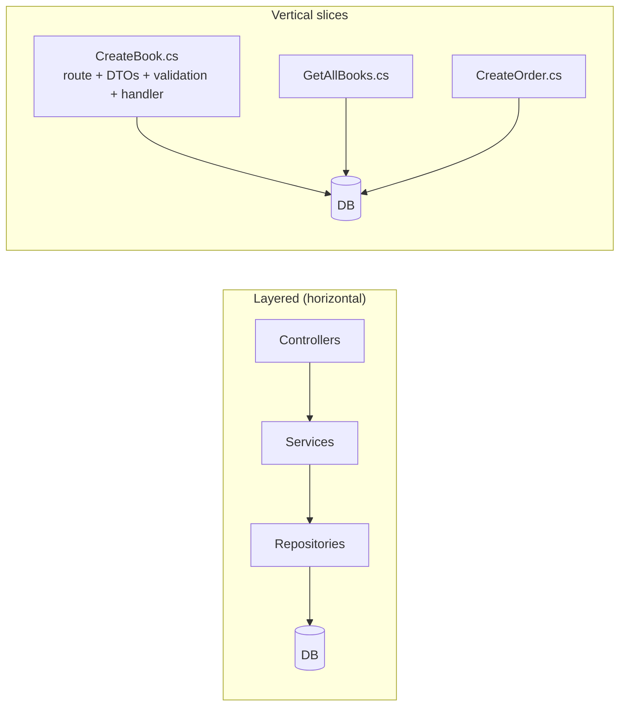

# BookStore — Vertical Slice Architecture Demo

A small, **self-contained** full-stack demo that illustrates the **Vertical Slice / single-file
endpoint** approach (built on [Ardalis.ApiEndpoints](https://github.com/ardalis/ApiEndpoints))
in ASP.NET Core, paired with a React client.

The goal is to show how a feature can live in **one file** — its route, request/response DTOs,
validation and handler all together — instead of being spread across controllers, services,
repositories and DTO folders. Everything runs **in-memory**, so you can clone the repo and run it
immediately without any database setup.

---

## What's inside

| Project | Stack | Purpose |
|---|---|---|
| `BookStore.Api` | .NET 10, ASP.NET Core, EF Core In-Memory, FluentValidation, Scalar | REST API organised by vertical slices |
| `bookstore.client` | React 19, Vite, TypeScript, axios | UI for managing books and orders |

### Domain

- **Book** — `Title`, `Author`, `Genre`, `Description`, `Price`.
- **Order** — `UserEmail`, `TotalPrice` (computed), and a list of order lines.
- **OrderItem** — links a book to an order with a `Quantity` and a **frozen** `UnitPrice`
  (so historic orders keep their price even if the book's price later changes).

The in-memory database is **seeded at startup** with 8 books and 2 orders, and **resets on every
restart**.

---

## Architecture: vertical slices

Instead of layering by *technical concern* (Controllers / Services / Repositories), the API is
organised by *feature*. Each use case is one class in its own file under `Features/`:



A typical slice (`Features/Books/CreateBook.cs`) contains everything for that endpoint:

```csharp
public class CreateBook
    : EndpointBaseAsync.WithRequest<CreateBook.CreateBookRequest>.WithActionResult<CreateBook.BookDto>
{
    private readonly AppDbContext _db;
    private readonly IValidator<CreateBookRequest> _validator;

    [HttpPost("api/books")]
    public override async Task<ActionResult<BookDto>> HandleAsync(
        [FromBody] CreateBookRequest request, CancellationToken ct = default) { /* ... */ }

    // Request + response DTOs live in the SAME file, as records:
    public record CreateBookRequest(string Title, string Author, string? Genre, string? Description, decimal Price);
    public record BookDto(int Id, string Title, string Author, string Genre, string Description, decimal Price);

    // FluentValidation validator also lives in the slice:
    public class Validator : AbstractValidator<CreateBookRequest> { /* ... */ }
}
```

**Why this layout?** Adding or changing a feature is a *local* change to one file. There are no
shared service/repository abstractions to ripple through — only genuinely shared helpers live
outside the slices (in `Helpers/`).

### The `[FromMultiSource]` helper

Ardalis endpoints take a **single** request object, but sometimes you need to bind from the route
**and** the query string at once. `Helpers/ArdalisHelpers.cs` defines a `[FromMultiSource]`
attribute that composes multiple binding sources. See `Features/Orders/AddBookToOrder.cs`:

```csharp
[HttpPost("api/orders/{OrderId:int}/books")]
public override async Task<ActionResult<OrderDto>> HandleAsync(
    [FromMultiSource] AddBookRequest request, CancellationToken ct = default) { /* ... */ }

// OrderId comes from the path, BookId + Quantity from the query string:
public record AddBookRequest(int OrderId, int BookId, int Quantity);
```

---

## API surface

| Method | Route | Slice |
|---|---|---|
| GET | `/api/books` | `GetAllBooks` (paged) |
| GET | `/api/books/{id}` | `GetBookById` |
| POST | `/api/books` | `CreateBook` |
| PUT | `/api/books/{id}` | `UpdateBook` |
| DELETE | `/api/books/{id}` | `DeleteBook` |
| GET | `/api/orders` | `GetAllOrders` (paged) |
| GET | `/api/orders/{id}` | `GetOrderById` |
| POST | `/api/orders` | `CreateOrder` |
| PUT | `/api/orders/{id}` | `UpdateOrder` |
| DELETE | `/api/orders/{id}` | `DeleteOrder` |
| POST | `/api/orders/{orderId}/books?bookId=&quantity=` | `AddBookToOrder` (`[FromMultiSource]`) |

Interactive docs (Scalar) are available in Development at **`/scalar/v1`**, reading the OpenAPI
document at `/openapi/v1.json`.

---

## File structure

```
northwind-vertical/
├─ BookStore.slnx                     # Solution (API + client)
│
├─ BookStore.Api/                     # ── ASP.NET Core API ──
│  ├─ Program.cs                      # DI, EF In-Memory, CORS, Scalar, startup seed
│  ├─ BookStore.Api.csproj
│  ├─ BookStore.Api.http              # Manual request examples
│  │
│  ├─ Features/                       # One folder per entity, one file per use case
│  │  ├─ Books/
│  │  │  ├─ GetAllBooks.cs            # paged list
│  │  │  ├─ GetBookById.cs
│  │  │  ├─ CreateBook.cs             # + nested FluentValidation validator
│  │  │  ├─ UpdateBook.cs
│  │  │  └─ DeleteBook.cs
│  │  └─ Orders/
│  │     ├─ GetAllOrders.cs
│  │     ├─ GetOrderById.cs
│  │     ├─ CreateOrder.cs            # looks up prices, freezes UnitPrice, computes total
│  │     ├─ UpdateOrder.cs
│  │     ├─ DeleteOrder.cs
│  │     └─ AddBookToOrder.cs         # demonstrates [FromMultiSource]
│  │
│  ├─ Helpers/                        # Genuinely shared cross-slice code
│  │  ├─ Paging.cs                    # ListRequest, PagedResult<T>, ToPagedResultAsync
│  │  ├─ ArdalisHelpers.cs            # [FromMultiSource] binding attribute
│  │  └─ ValidationExtensions.cs      # FluentValidation → ModelState mapping
│  │
│  ├─ Models/Data/                    # Entities + EF context
│  │  ├─ Book.cs
│  │  ├─ Order.cs
│  │  ├─ OrderItem.cs                 # computed LineTotal = UnitPrice * Quantity
│  │  ├─ AppDbContext.cs
│  │  └─ DbSeeder.cs                  # idempotent seed (8 books, 2 orders)
│  │
│  └─ Properties/launchSettings.json  # http://localhost:5212, auto-opens Scalar
│
└─ bookstore.client/                  # ── React + Vite client ──
   ├─ vite.config.ts                  # dev server :56789, proxies /api → :5212
   ├─ package.json
   └─ src/
      ├─ main.tsx                     # React entry point
      ├─ App.tsx                      # tab navigation: Books / Orders
      ├─ App.css, index.css           # styling
      ├─ types.ts                     # TS types mirroring API contracts
      ├─ api.ts                       # axios client (booksApi, ordersApi) + error mapping
      ├─ components/
      │  ├─ Modal.tsx                 # generic modal shell (backdrop + header)
      │  ├─ BookModal.tsx             # self-contained create/edit-book form
      │  └─ OrderModal.tsx            # self-contained create/edit-order form
      └─ pages/
         ├─ BooksPage.tsx            # list + pagination, opens BookModal
         └─ OrdersPage.tsx           # list + pagination, opens OrderModal
```

### Client design

The pages own only **list / pagination state** and which item is being edited. The
create/edit forms are extracted into **self-contained modal components** (`BookModal`,
`OrderModal`) that manage their own form state and call the API directly. The parent simply
decides *when* a modal is open and *what* it edits:

```tsx
<BookModal open={modalOpen} book={editingBook /* null = new */} onClose={...} onSaved={...} />
```

---

## Running it

You need **two terminals** — the API and the client run side by side. The Vite dev server proxies
`/api` calls to the API, so no CORS configuration is needed for local development.

**1. API** (opens the Scalar UI automatically):

```bash
cd BookStore.Api
dotnet run
# → API at http://localhost:5212
# → Scalar UI at http://localhost:5212/scalar/v1
```

**2. Client:**

```bash
cd bookstore.client
npm install      # first time only
npm run dev
# → http://localhost:56789
```

Open <http://localhost:56789>, then use the **Books** and **Orders** tabs to create, edit and
delete records. Validation errors from the API (FluentValidation) are surfaced in the modal forms.

### Prerequisites

- [.NET 10 SDK](https://dotnet.microsoft.com/download)
- [Node.js](https://nodejs.org/) (18+)

---

## Tech notes

- **EF Core In-Memory** — no database to install; data lives in process memory and resets on
  restart. Swapping to a real provider is a one-line change in `Program.cs`.
- **FluentValidation** — validators are registered with
  `AddValidatorsFromAssemblyContaining<Program>()` and injected as `IValidator<T>`; each one lives
  inside its slice, so adding validation stays a local change.
- **Scalar** — modern OpenAPI explorer, only mapped in the Development environment.
- **HTTPS redirect** is skipped in Development so the plain-HTTP Vite proxy works without 307
  redirects.
